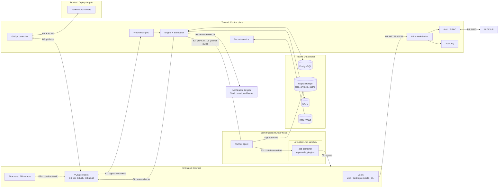

# Kiln Threat Model

| | |
|---|---|
| **Status** | Draft v0.2 — Phase 0 controls implemented (see statuses in §6) |
| **Method** | STRIDE per trust boundary, risk = likelihood × impact |
| **Owners** | Security owners group (see `CODEOWNERS`) |
| **Related** | `docs/engineering/security-standards.md` (controls, referenced as `SS §n`), ADRs in `docs/adr/` |
| **Review** | Every change that moves a trust boundary; full review each minor release and before 1.0 |

---

## 1. System overview

Kiln is a self-hosted CI/CD platform. A control plane receives VCS webhooks, plans
pipeline runs, and hands jobs to runners that execute repository code in containers.
A GitOps controller reconciles Kubernetes clusters to manifests in git. Users interact
through web, desktop, and mobile clients and a CLI.

Kiln's defining risk: **it executes code written by people who are not fully trusted,
on infrastructure that is trusted, next to credentials that can deploy to
production.** A compromise of Kiln is a supply-chain compromise of every
organization and deployment it serves.

---

## 2. Data flow diagram

---

## 3. Assets

| ID | Asset | Why it matters | Sensitivity |
|---|---|---|---|
| A1 | Pipeline and deploy secrets | Grant access to registries, cloud accounts, production systems | Critical |
| A2 | Cluster credentials (GitOps) | Direct control of production workloads | Critical |
| A3 | VCS tokens / app private keys | Read and write access to customer source code | Critical |
| A4 | Master / data encryption keys | Unlock every stored secret | Critical |
| A5 | Build artifacts and container images | Tampering poisons downstream deployments | High |
| A6 | Build caches | Poisoned cache = code execution in trusted builds | High |
| A7 | Source code in workspaces | Customer intellectual property | High |
| A8 | Identities, sessions, API tokens, runner certs | Impersonation of users and runners | High |
| A9 | Audit log | Needed for detection, forensics, compliance | High |
| A10 | Build logs | Can contain leaked secrets and internal details | Medium–High |
| A11 | Release signing identity for Kiln itself | Compromise affects every Kiln installation | Critical |
| A12 | Service availability | Blocked deploys, blocked incident fixes | Medium |

---

## 4. Actors

| Actor | Trust | Capabilities assumed |
|---|---|---|
| Anonymous internet user | None | Reaches API and webhook endpoints |
| Fork PR author | None | Controls pipeline YAML, code, and event fields (branch name, PR title) of their PR |
| Org member (developer) | Partial | Pushes to non-protected branches, triggers runs, reads logs of their projects |
| Org admin | High within org | Manages secrets, RBAC, runners, GitOps apps for one org |
| Instance admin | Full | Operates the Kiln installation |
| Other-tenant user | None toward this org | Authenticated in a different org on a shared instance |
| Compromised runner host | Partial | Full control of one runner process and host |
| Malicious plugin / base image author | None | Controls code run as a pipeline step |
| Malicious dependency (Kiln's own supply chain) | None | Code executes in Kiln build or runtime |
| Network attacker | None | Observes or modifies traffic between components |

---

## 5. Trust boundaries

| ID | Boundary | Crossing |
|---|---|---|
| B1 | Internet → control plane | API, WebSocket, webhook ingest |
| B2 | Control plane ↔ runner | gRPC job leases, secrets delivery, log streaming |
| B3 | Runner → job sandbox | Untrusted code executing next to runner and host |
| B4 | Control plane → deploy targets | GitOps sync with cluster credentials |
| B5 | Clients (web, desktop, mobile, CLI) → API | Tokens stored on user devices; local runner on desktop |
| B6 | Control plane / jobs → third parties | IdP, VCS, Vault, notification targets, internet egress |
| B7 | Kiln's own build and release pipeline → users | Distributed binaries, images, Helm chart |

---

## 6. Threats and mitigations

Risk ratings: Likelihood (L/M/H) × Impact (L/M/H/C) → **Risk** (Low / Medium / High /
Critical). Status: **P** = planned (design), **I** = implemented, **V** = verified by
test (named). Updated for Phase 0 (ADR-0002, ADR-0003).

### B1 — Internet → control plane

| ID | STRIDE | Threat | L | I | Risk | Mitigations | Status |
|---|---|---|---|---|---|---|---|
| T-01 | S | Forged webhook triggers runs or deploys on attacker-chosen refs | H | H | **High** | HMAC/token verification before parsing, constant-time compare, replay window via delivery ID + timestamp (SS §6, §11) | P |
| T-02 | S | Session hijack via stolen cookie or CSRF | M | H | **High** | `__Host-` HttpOnly Secure SameSite cookies, CSRF tokens, session rotation, idle/absolute timeouts (SS §3, §10) | V (TestSession_CSRFAndOriginChecks, TestSession_Timeouts, TestLogout_RevokesSession) |
| T-03 | S | API token leakage in logs, repos, or screenshots | M | H | **High** | Hashed at rest, prefixed for secret scanners, scoped, expiring, revocable, last-used tracking (SS §3) | V (TestAPITokens_ScopedExpiringAndRevocable) |
| T-04 | E | IDOR: user reads or mutates another org's runs, secrets metadata, or apps | H | C | **Critical** | Resource-level `authz.Check`, `org_id` required in every tenant query, 404 on cross-org, authz matrix test (SS §4) | V (TestAuthzMatrix: every route x role x foreign org; composite `(org_id, …)` foreign keys make runs/jobs unable to reference another org's project or run: TestCreateRun_OrgMustOwnProject) |
| T-05 | E | Missing permission on a new endpoint | M | C | **High** | Deny-by-default router; startup check + CI test fails on routes without declared permission (SS §4) | V (router startup check; TestRouter_RejectsUnsafeRegistrations, TestRoutesMatchSpec) |
| T-06 | T | SQL injection via filters, sort, or search | L | C | **Medium** | sqlc only, allow-listed sort/filter fields, Semgrep rule banning string SQL (SS §6) | I (sqlc only; Semgrep kiln-go-string-built-sql) |
| T-07 | T | Malicious pipeline YAML causes parser DoS or type confusion | H | M | **High** | Safe loader: size, depth, node, alias limits; strict schema; fuzzing (SS §5) | V (engine/spec: TestParse_MaliciousFixtures, TestParse_Limits, TestParse_ErrorsNeverEchoValues, FuzzParse) |
| T-08 | I | Verbose errors leak internals (SQL, paths, stack traces) | M | M | **Medium** | Single problem-mapping layer, generic messages, `requestId` for correlation | V (TestErrorWriter_UnexpectedErrorIsGenericAndLoggedOnce) |
| T-09 | I | Stored XSS through logs, PR titles, commit messages, or markdown | H | H | **High** | React escaping, sanitized ANSI log renderer, markdown sanitizer, strict CSP (SS §6, §10) | I (React escaping, strict CSP, ESLint/Semgrep bans; untrusted run titles/branches/step names have control and Unicode format characters (bidi overrides, zero-width) replaced); log viewer: Phase 1 |
| T-10 | D | Webhook floods, huge payloads, log-stream fan-out exhaust resources | H | M | **High** | Body size limits, rate limits per IP/principal, per-org quotas, async webhook queue (SS §5, §12) | I (body limits, per-IP /64 + per-principal rate limits; log streams capped per principal (10) and in duration (30 min), log chunks 256 KiB and 64 MiB/job: TestAppend_TruncatesAtTheLimit); webhook queue: Phase 1 slice 8 |
| T-11 | R | Admin denies changing a secret or RBAC rule | M | M | **Medium** | Append-only, hash-chained audit log exported to SIEM (SS §12) | I (hash-chained audit, TestVerify_DetectsTampering); SIEM export: Phase 2 |
| T-53 | S | Login CSRF: attacker completes their own login in a victim's browser | M | M | **Medium** | Login state bound to the browser by a `__Host-` HttpOnly cookie, single-use server-side state, PKCE, nonce (ADR-0003) | V (TestWebLogin_RequiresBrowserBindingCookie, TestWebLogin_StateIsSingleUseAndExpires) |
| T-54 | T | Open redirect through `returnTo` or the desktop `redirectUri` | M | M | **Medium** | OpenAPI pattern + `safeReturnTo` (same-origin paths only); desktop redirect pinned to `http://127.0.0.1:<port>/callback` | V (TestWebLogin_ReturnToCannotRedirectOffSite, TestSafeReturnTo_PreventsOpenRedirect) |
| T-56 | R | Attacker-controlled input (e.g. malformed User-Agent) makes audit inserts fail, silently dropping sign-in events | M | M | **Medium** | Metadata sanitized to valid UTF-8 on a rune boundary before audit insert (security review M2) | V (TestWithFrom_SanitizesUserAgent) |
| T-57 | D | Rate-limit evasion by rotating IPv6 addresses or spoofing `X-Forwarded-For` | H | M | **High** | Limits keyed per IPv4 address / IPv6 /64; XFF trusted only from configured proxies; bounded O(1) eviction (security review M3) | V (TestNetworkKey, TestClientIP, TestKeyed_ChurnStaysFast) |
| T-58 | E | IdP asserts another account's (bootstrap) email, escalating to instance admin | L | H | **Medium** | Admin granted only from the email the account actually holds; accounts never merged by email (security review M1) | V (TestProvisioning_CollidingBootstrapEmailDoesNotGrantAdmin) |

### B2 — Control plane ↔ runner

| ID | STRIDE | Threat | L | I | Risk | Mitigations | Status |
|---|---|---|---|---|---|---|---|
| T-12 | S | Rogue runner registers and receives jobs with secrets | M | C | **High** | Single-use registration tokens, mTLS certs with short validity, admin approval option, runner label policies (SS §3) | V (single-use hashed `kiln_rrt_` tokens, CSR proof of possession, server-set identity; renewal only from the current serial, any stale-serial use revokes and audits, lost-response retries are idempotent; revocation re-checked at lease grant: TestRunnerProtocol_*, TestLease_RevokedRunnerIsNotGrantedAJob); admin approval option: later |
| T-13 | E | Compromised runner requests jobs or secrets beyond its scope | M | C | **High** | Runner principal limited to leases for its labels; secrets bound to lease; lease-scoped log/artifact writes (SS §4, §7) | V (runner principal loaded from the DB on every call; leases scoped to org + label subset; trusted runners never take untrusted jobs: TestLease_LabelsAndTrust, TestRunnerProtocol_LabelsComeFromTheServer); secrets bound to leases: Phase 2 |
| T-14 | T | Compromised runner forges job results (marks failing tests as passed, swaps artifacts) | M | H | **High** | Results tied to lease; artifact digests recorded; provenance attestations signed server-side; protected deploys require trusted runners (SS §8) | I (results bound to lease ID + runner + unexpired lease: TestLease_BoundToRunnerAndLeaseID); artifact digests/provenance: Phase 3 |
| T-15 | I | Secrets intercepted in transit | L | C | **Medium** | mTLS 1.3, no plaintext fallback, cert pinning to Kiln CA | I (TLS 1.3 only, mutual auth against the Kiln runner CA pinned by runners; foreign-CA certs rejected: TestRunnerProtocol_RejectsForeignCertificates) |
| T-16 | D | Runner holds leases without progress, starving the queue | M | M | **Medium** | Lease heartbeats with expiry, max job duration, per-runner concurrency caps | V (lease expiry + reaper, hard job timeouts, long-poll cap, per-runner rate limits: TestReap_RequeuesThenFailsExpiredLeases, TestHeartbeat_ReportsCancelAndTimeout) |
| T-17 | T | Protocol downgrade/mismatch exploited by old runner | L | M | **Low** | Version negotiation, minimum supported runner version enforced | I (protocol_version on every request; unsupported versions get FAILED_PRECONDITION: TestAuthorize_DeniesUnknownMethodsAndBadVersions) |
| T-59 | D | One runner credential floods the shared database with lease polls or hoards jobs | M | M | **Medium** | At most 2 concurrent polls per runner with backoff, per-runner call rate limits, capped connections, per-runner job capacity checked at grant time (ADR-0005 §7) | V (TestRunnerProtocol_ConcurrentPollsAreCapped, TestLease_RunnerCapacityAndStaleLabels) |

### B3 — Runner → job sandbox (highest-risk boundary)

| ID | STRIDE | Threat | L | I | Risk | Mitigations | Status |
|---|---|---|---|---|---|---|---|
| T-18 | I | **Fork PR exfiltrates secrets** (echo, encode, send over network) | H | C | **Critical** | No secrets for fork PRs by default; approval gate for first-time contributors; masking incl. encoded forms; secrets restricted to protected branches (SS §7, §8) | P |
| T-19 | E | Container escape to runner host (privileged, Docker socket, kernel exploit) | M | C | **High** | Non-root, no privileged, caps dropped, seccomp/AppArmor, no Docker socket, rootless BuildKit, optional gVisor/Kata, ephemeral runners (SS §8) | P |
| T-20 | E | Job reaches cloud metadata service and steals node credentials | H | C | **Critical** | NetworkPolicy/iptables block metadata IPs, IMDSv2 hop limit 1, no node IAM roles on runner nodes | P |
| T-21 | E | Job reaches internal services or K8s API from the runner network | H | H | **High** | Default-deny egress to private ranges; separate runner network/namespace; K8s API blocked (SS §8) | P |
| T-22 | T | **Cache poisoning**: untrusted branch writes cache later restored by `main` | M | C | **High** | Cache keys scoped by project and branch protection level; untrusted runs read-only on protected caches (SS §8) | P |
| T-23 | I | Workspace or cache leaks data between jobs/projects | M | H | **High** | Workspace wiped per job, per-project cache namespaces, ephemeral runners recommended | P |
| T-24 | T | Script injection via event fields (`${{ event.pr.title }}` in `run:`) | H | H | **High** | Expressions never interpolated into shell; event data passed as env vars; `kiln lint` warns on unsafe patterns (SS §5) | I (spec v1 rejects `${{`: testdata/invalid/expression-injection.yaml; env-var delivery lands with the runner) |
| T-25 | E | Malicious plugin image runs with elevated rights | M | H | **High** | Plugins get no extra caps unless declared + admin-approved; digest pinning; signed plugin registry | P |
| T-26 | D | Crypto-mining or fork bombs exhaust runner resources | H | M | **High** | CPU, memory, PID, disk, and time limits; per-org concurrency quotas | P |
| T-27 | I | Secret masking bypass (split output, char-by-char, alternate encodings) | H | H | **High** | Masking of base64/URL/hex variants, streaming masker handling chunk boundaries; documented that masking is a safety net, not a boundary — T-18 controls are primary | I (runner-side streaming masker for raw/base64 (3 alignments)/hex/URL/per-line variants across chunk boundaries, overlapping matches merged: runner/internal/mask FuzzMask); wiring into the agent: Phase 1 slice 6 |

### B4 — Control plane → deploy targets (GitOps)

| ID | STRIDE | Threat | L | I | Risk | Mitigations | Status |
|---|---|---|---|---|---|---|---|
| T-28 | E | Manifests in git create resources outside allowed namespaces or kinds (e.g., ClusterRoleBinding) | M | C | **High** | Per-app allow-lists of namespaces and kinds, enforced pre-apply; namespace-scoped service accounts (SS §9) | P |
| T-29 | E | Helm/Kustomize rendering executes attacker-controlled logic or reads server files | M | H | **High** | Sandboxed renderer subprocess, no plugins/exec, path confinement, no network to internal services, time/memory limits (SS §9) | P |
| T-30 | T | Unauthorized commit to the config repo deploys to production | M | C | **High** | Optional required commit signatures, protected branches, production sync approval, drift alerts | P |
| T-31 | S | Attacker points an Application at a malicious repo | L | H | **Medium** | App source changes require admin + audit; repo allow-list per org | P |
| T-32 | I | Cluster credentials exposed via UI, API, or logs | L | C | **Medium** | Write-only credential storage, never rendered or logged, envelope encryption (SS §7) | P |
| T-33 | R | Unable to determine who triggered a harmful sync | M | H | **Medium** | Sync records actor, revision, diff hash; audit export | P |

### B5 — Clients → API

| ID | STRIDE | Threat | L | I | Risk | Mitigations | Status |
|---|---|---|---|---|---|---|---|
| T-34 | I | Tokens stolen from device storage (browser storage, AsyncStorage, config files) | M | H | **High** | Cookies for web; OS keychain/keystore for desktop, mobile, CLI; short-lived access + rotating refresh tokens (SS §3, §10) | I (HttpOnly cookies; desktop refresh token in OS keychain, access token in Rust memory only) |
| T-35 | E | Desktop app IPC abused (XSS in webview → Tauri command → local shell) | M | C | **High** | Minimal allow-listed Tauri capabilities, strict CSP, no remote content in privileged windows (SS §10) | I (5 allow-listed Tauri commands, no plugins, strict CSP; Rust proxies only /api/v1/* checked on the normalized URL, access tokens bound to the issuing server origin; `api_requests_are_confined_to_the_api`) |
| T-55 | S | Desktop login code obtained silently by a website (victim already signed in at the IdP) and delivered to any local listener; or local processes stalling the loopback listener | M | H | **Medium** | Desktop logins request `prompt=login`; PKCE verifier and state held by the app; state checked in constant time; idle or broken loopback connections are dropped without aborting sign-in. Residual: `prompt` is advisory (auth_time not yet verified, see §9) | I (TestOIDCProvider_AuthCodeURLUsesPKCEAndNonce, TestDesktopFlow) |
| T-36 | E | Other local processes or websites drive the desktop local runner | M | H | **High** | Local socket or loopback with per-session token and Origin checks | P |
| T-37 | T | Malicious desktop update delivered | L | C | **Medium** | Signed updates with pinned public key; HTTPS-only update feed | P |
| T-38 | S | Malicious deep link or push notification triggers approval or deploy | M | H | **High** | Deep links navigate only; actions require in-app confirmation + biometric for approvals (SS §10) | P |
| T-39 | I | Sensitive screens captured in app switcher or screenshots | M | L | **Low** | Snapshot protection on sensitive mobile screens | P |

### B6 — Third-party integrations and egress

| ID | STRIDE | Threat | L | I | Risk | Mitigations | Status |
|---|---|---|---|---|---|---|---|
| T-40 | E | **SSRF** via notification webhooks, repo URLs, or OIDC discovery reaching metadata or internal services | H | C | **Critical** | `platform/httpclient`: DNS-resolve-then-check, block private/loopback/link-local/metadata, re-check on redirect, admin allow-list (SS §6) | V (TestAddrPolicy_*, TestClient_BlocksLoopbackEndToEnd) |
| T-41 | S | IdP misconfiguration accepts tokens for wrong audience/issuer | M | C | **High** | Strict `iss`, `aud`, `exp`, `nonce` validation; PKCE; per-org IdP binding | V (TestOIDCProvider_Exchange: iss/aud/exp/nonce/signature) |
| T-42 | I | Over-scoped VCS app permissions amplify a Kiln compromise | M | H | **High** | Minimal GitHub App permissions, per-installation tokens, short-lived installation tokens | P |
| T-43 | T | Commit status spoofing (attacker marks own PR green) | L | M | **Low** | Status posting only from control plane with app credentials; required checks tied to Kiln app identity | P |

### Data stores and platform

| ID | STRIDE | Threat | L | I | Risk | Mitigations | Status |
|---|---|---|---|---|---|---|---|
| T-44 | I | Database or backup theft exposes secrets | M | C | **High** | Envelope encryption with keys outside the DB (KMS/Vault); encrypted backups; tokens hashed (SS §7) | I for credentials (SHA-256 hashes only); secret encryption: Phase 2 |
| T-45 | I | Public or misconfigured object storage bucket exposes logs/artifacts | M | H | **High** | Private buckets, pre-signed URLs with short expiry and authz check, Helm defaults verified by Trivy | I (logs served only through authorized API routes, never pre-signed URLs; S3 endpoint reached through platform/httpclient: TestS3_PutGetThroughHardenedClient); Helm defaults: Phase 5 |
| T-46 | T | Audit log tampering by an attacker with DB access | L | H | **Medium** | Hash-chained records, periodic anchoring, SIEM export | I partial (append-only trigger + hash chain); anchoring and role separation: see §9 |
| T-47 | E | Instance admin or insider abuses access to read secrets | L | C | **Medium** | Secrets write-only via API; decryption only in leases; admin actions audited; optional two-person approval | P |

### B7 — Kiln's own supply chain

| ID | STRIDE | Threat | L | I | Risk | Mitigations | Status |
|---|---|---|---|---|---|---|---|
| T-48 | T | Malicious or typosquatted dependency | M | C | **High** | Lockfiles, osv-scanner/govulncheck/pnpm audit, dependency review, license allow-list, verification of new packages (SS §13, §15). 7-day release age: `minimumReleaseAge` in `pnpm-workspace.yaml` applies only when pnpm resolves, so the `lockfile-age` job in `security.yml` (`scripts/check-lockfile-age.mjs`) diffs `pnpm-lock.yaml` against the PR base and fails if any newly added `packages:` `name@version` was published to npm < 7 days ago or its lockfile integrity differs from npm's `dist.integrity`, if either cannot be verified, or if an existing entry's integrity changes. The lockfile is parsed as a strict subset of pnpm's v9 output and anything else fails closed: every line must be a complete single-line construct (no quoted string or flow collection may span lines, so indentation alone determines structure), top-level keys and entry fields are allow-listed, every `snapshots:` key must map to a `packages:` entry, and `version`/`name`/`resolution` overrides, anchors, aliases, tags, double quotes, and stray CRs are rejected. CI runs the base branch's copy of the script so a PR cannot weaken its own gate; the threshold is hard-coded so a PR cannot lower it; the script, workflow, lockfile, and pnpm config (`pnpm-workspace.yaml`, `.npmrc`, root `package.json`, `.pnpmfile.cjs`, `patches/`) are security-owner CODEOWNERS paths. Residual: the gate hand-parses a YAML subset while pnpm uses lenient js-yaml, so an undiscovered parsing differential could hide an entry from the gate (the integrity match protects only entries the gate sees); the workflow file itself comes from the PR under `pull_request`, so the gate relies on required code-owner review of `.github/workflows/`; pnpm output the grammar does not yet cover (e.g. `patch_hash=` snapshot suffixes once `patchedDependencies` is used, double-quoted `deprecated:` messages) fails closed and needs a reviewed script change; packages already on `main` are not re-checked; the gate protects `main` only as a required status check on PRs; no exemption mechanism (an urgent security bump < 7 days needs a security-owner admin merge) | I (lockfiles, govulncheck, osv-scanner, pnpm audit, license allow-list, lockfile release-age gate — unit tests in `scripts/check-lockfile-age.test.mjs`) |
| T-49 | T | Compromised GitHub Action or workflow injection in Kiln's CI | M | C | **High** | SHA-pinned actions, minimal `permissions`, no `pull_request_target`, zizmor + actionlint (SS §13) | I (SHA-pinned actions, minimal permissions, actionlint, zizmor) |
| T-50 | T | Tampered release binary, image, or Helm chart | L | C | **Medium** | Reproducible builds, cosign signatures, SLSA provenance, SBOM, verification docs (SS §13) | P |
| T-51 | T | Maintainer account takeover pushes malicious code | L | C | **Medium** | Hardware-key MFA for maintainers, signed commits, branch protection, two approvals on sensitive paths | P |
| T-52 | E | AI-generated code introduces subtle vulnerabilities | M | H | **High** | Same gates as human code, security-reviewer subagent, human security owner review on sensitive paths (SS §15) | P |

---

## 7. Top risks (attack scenarios)

These drive design priorities and must have end-to-end tests before 1.0.

### S1. Fork PR steals production credentials (T-18, T-20, T-22, T-24)
1. Attacker opens a PR from a fork, modifying the pipeline to `curl` environment
   variables to their server, or to read cloud metadata.
2. If secrets were injected, or the metadata endpoint was reachable, they leave the network.
3. Alternatively, the PR writes a poisoned dependency cache later restored by `main`,
   gaining execution in a trusted build with deploy secrets.

**Controls that must all hold:** no secrets and no trusted runners for fork PRs;
metadata and private ranges blocked from jobs; caches scoped by trust level;
first-time-contributor approval gate.
**E2E test:** fork PR attempts each path; all fail and are logged.

### S2. Cross-tenant data access (T-04, T-05, T-44)
1. User in org A enumerates run or app IDs belonging to org B.
2. A missing `org_id` filter or missing authz call returns B's logs (which may contain secrets) or lets A trigger B's deploy.

**Controls:** deny-by-default routing, resource-level authz in services, `org_id`
required by repository signatures, 404 on cross-org, authz matrix test on every endpoint.
**Test:** authz matrix runs in CI for every route.

### S3. Runner compromise → production deploy (T-12, T-13, T-14, T-19)
1. Attacker escapes a job container, takes over the runner host.
2. Uses the runner's identity to lease jobs from other projects or forge successful results for a deploy pipeline.

**Controls:** ephemeral runners, hardened sandbox, runner principal scoped to labels,
trusted runner pools separate from untrusted ones, results bound to leases, artifact
digests and provenance verified before GitOps deploy.
**Test:** a runner cert for pool "untrusted" cannot lease a "trusted" job or post results for another lease.

### S4. SSRF to cloud metadata from the control plane (T-40)
1. Admin-level or tenant-configurable URL (notification webhook, repo URL) set to `http://169.254.169.254/...` or a DNS name resolving there.
2. Server fetches it and returns or logs the response, leaking cloud credentials.

**Controls:** all outbound HTTP through `platform/httpclient` with DNS rebinding–safe checks.
**Test:** fuzz-style suite of metadata IPs, IPv6 forms, decimal/octal encodings, and redirect chains.

---

## 8. Security assumptions

Controls above depend on these. If any is false for a deployment, document the
compensating control.

- The container runtime and host kernel are patched; runner hosts are dedicated to Kiln.
- Operators deploy runners for untrusted code on separate hosts/nodes from trusted runners.
- The OIDC IdP is correctly configured and enforces MFA for admins.
- KMS/Vault (or `KILN_MASTER_KEY`) is stored outside the database and its backups.
- TLS certificates for the public endpoint are managed by the operator.
- Clocks are reasonably synchronized (token expiry, lease timeouts, webhook replay window).

## 9. Accepted and residual risks

| Risk | Rationale | Revisit |
|---|---|---|
| Trusted-branch pipelines can exfiltrate secrets they are given | Inherent to CI: code on protected branches is trusted by the org. Mitigated by branch protection, code review, and least-privilege secrets | Never fully removable; document for users |
| Secret masking can be bypassed by determined code | Masking is a safety net, not a boundary; primary control is not giving secrets to untrusted code | Ongoing |
| Kernel-level container escapes (0-days) | Mitigated by ephemeral runners and optional gVisor/Kata; residual risk accepted for default runc | Before 1.0: consider stronger default for hosted mode |
| Instance admin can ultimately access secrets | Operators control the infrastructure; mitigated by audit and optional two-person rules | Enterprise edition features |
| Single-node mode with `KILN_MASTER_KEY` on same host as DB | Convenience for small installs; documented as not production-grade | Docs |
| Audit chain can be rewritten by anyone holding the app's own DB role (it owns the table, so it can disable the trigger and recompute the chain), and truncating the newest events is undetectable | The chain detects edits by anyone without the DB role; stronger controls need deployment changes | Phase 2: separate migration/owner role, grant the app INSERT/SELECT only, HMAC key or periodic head anchoring to SIEM |
| Removing an email from `KILN_AUTH_BOOTSTRAP_ADMIN_EMAILS` does not revoke instance admin | Grant-only by design (a restart must not lock admins out) | Add an explicit admin-revocation command before 1.0 |
| The API-token cap (50) can be exceeded slightly by concurrent requests | Count-then-insert under READ COMMITTED; impact is a few extra tokens | Revisit if tokens gain write scopes |
| Desktop `prompt=login` is advisory: an IdP that ignores it lets an already signed-in user's desktop code be issued without re-authentication | PKCE + state still bind the code to the app that started the flow | Phase 1: send `max_age=0` and verify `auth_time` for desktop logins |
| Personal API tokens are read-only in Phase 0 | Write scopes need finer-grained authz first | Phase 1 |

## 10. Out of scope

Physical security of operator infrastructure; vulnerabilities in customer application
code built by Kiln; security of third-party VCS/IdP platforms themselves; volumetric
network DDoS (handled at the operator's edge).

## 11. Open questions

- Should hosted/multi-tenant mode require gVisor or Firecracker by default?
- Do we support self-signed commit verification (GPG, SSH, Sigstore gitsign) for GitOps in v1?
- Two-person approval for secret and RBAC changes: core feature or optional policy?
- Retention policy for build logs that may contain secrets despite masking.

## 12. Maintenance

- Update this document in the same PR as any change that adds or moves a trust
  boundary, adds an external integration, or changes how secrets or credentials flow.
- Move threat status from P → I → V as controls ship, linking the implementing PR
  and test.
- Every fixed vulnerability adds or updates a threat entry here.
- Revisit risk ratings at each minor release and after any security incident.
